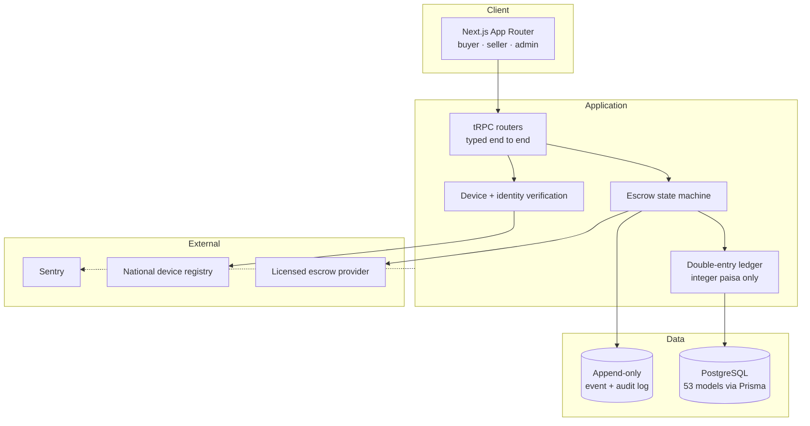
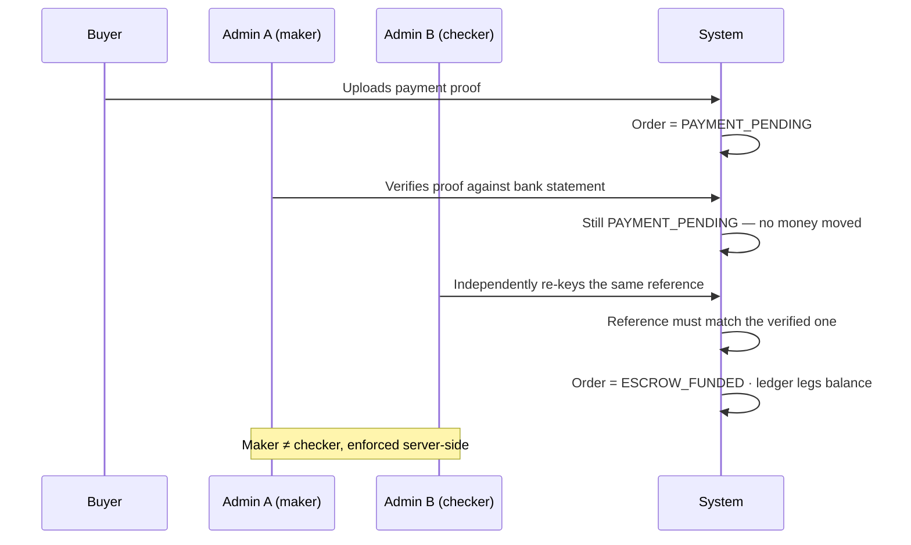
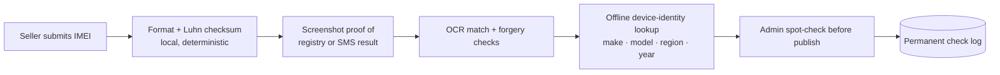

# NoSiappa.pk — building a marketplace with escrow, solo, in 52 days

[Live](https://nosiappa-pk.vercel.app) · source private

A peer-to-peer marketplace for used smartphones in Pakistan, where every payment is held in escrow, sellers are identity-verified, and every device is checked against the national stolen-handset registry before a listing goes live.

`Next.js 15` · `tRPC` · `Prisma` · `PostgreSQL` · `TypeScript` · `Vercel` · `Sentry`

---

## Shape of the build

| | |
|---|---|
| Calendar span | 2026-06-13 → 2026-08-03 · 52 days |
| Days with commits | 42 |
| Commits | 396 · zero reverts |
| Tracked files | 932 |
| TypeScript / TSX | ~79,700 lines |
| API surface | 79 tRPC routers |
| Data layer | 53 models · 56 enums · 37 migrations |
| Tests | 2,339 across 204 files |
| Agent-assisted commits | 377 of 396 — every one reviewed and approved by me before merge |

---

## Architecture

Two rules shaped most of the rest:

1. **Money is integer paisa. Never a float, anywhere.**
2. **Every state change is one atomic transaction** that writes an append-only event row *and* balanced ledger entries. If it can't do both, it doesn't happen.

---

## Separation of duties, enforced in the database

Recognising a buyer's bank transfer used to be one admin clicking one button. That is a single point of both error and fraud, so it was split into a maker/checker flow:

Verifying alone moves nothing. The checker must be a different person, and the reference they re-key must match. Payouts are never marked sent by code either — a human approves them.

This is an ordinary banking control. It's uncommon to see it in a small product, and it was worth the day it took.

---

## Verification, described honestly

The public-facing claim is that a device is checked against the national registry. What that actually means:

The national registry is a reCAPTCHA-protected web form with no public API, so a direct integration does not exist to build. What exists instead is format validation, OCR of submitted proof with forgery detection, an offline device-identity lookup, a human spot-check, and a permanent audit log of every check. Identifiers are stored encrypted and masked in public views.

> "Integrated with the registry" would be the impressive version and it would be false. Being able to explain why the API doesn't exist, and what was built instead, is the more useful answer.

---

# Problems found, and what corrected them

Everything below was caught before it reached a user. They're described as *classes of bug and the controls that closed them* — no reproduction steps, since the system is live.

---

## A private field leaking through an ORM convenience

A bare `include` on a relation in most ORMs returns **every scalar column** of that model. Used on a listing relation, that quietly serialised sellers' private pricing thresholds and encrypted device identifiers into responses buyers could read.

The guard already existed. An earlier change had stripped those fields from the public listing payload and left a comment saying they must never be serialised. Three other query paths didn't go through it.

**The correction:** replacing every convenience `include` with an explicit `select`, and adding a test that greps the source for the leaking shape so CI fails the moment someone writes it again. It caught two more instances immediately — ones I had missed by hand.

> A comment saying "never serialise these" is not a control. A test that reads the source and fails the build is.

## A time-of-check/time-of-use race on withdrawals

Available balance was checked and the withdrawal was inserted in separate steps, so two concurrent requests could both pass the check.

**The correction:** recompute the balance and insert inside a single serializable transaction, with serialization conflicts surfaced to the user as a retry rather than an error.

## Double-funding one order from one transfer

The same bank reference could fund two orders.

**The correction:** a **database unique constraint** on the funding reference — not application logic. Application logic can be raced; a constraint can't.

---

## Where agent-written code failed, and what fixed it

The single clearest repeated pattern across the project was not hallucinated APIs or broken syntax. It was **incomplete generalisation** — a correct fix landing on one code path while structurally identical siblings kept the bug.

It happened at least three times on money paths, and once on a dispute-escalation guard that was added to one side of a two-sided flow, leaving resolved disputes reopenable from the other side.

The countermeasure that worked wasn't procedural. Rules like "check the other call sites" decay. What worked was **structural: extract the shared rule into one helper so there is no second definition to forget.**

A related lesson, from making a rate lookup strict: it broke four test files whose mocks had never declared the value. Those tests had been passing through a swallowed-error fallback the whole time.

> When a change turns previously-green tests red, that is usually evidence the old behaviour was wrong — not a reason to soften the change.

---

## A rulebook that accumulated from incidents

The agent instruction file was committed and versioned like code, edited across 20 commits, and grew a `Lessons` section to 24 rules. Every rule is one sentence of what went wrong plus one of what to do instead, and most name the incident that caused them. A few:

- A "stopped" background process on Windows can orphan its child. A halted database seed kept writing during a cleanup; the tell was row counts growing between two dry runs.
- A confirmation prompt reading from piped, non-TTY stdin never resolves — the script exits 0 having done **nothing**. A destructive operation "succeeded" twice as a no-op before this was caught.
- Merged ≠ shipped. A week of commits served stale code for a day. "The site loads" proves nothing.
- Any new guard must ship with its symmetric path retrofitted in the same change.

That last one is the generalisation lesson above, written down after it cost something.

Two standing rules sat above all of them and never moved: **no pull request is ever self-merged**, and **production database writes need explicit approval per migration**. That's why 377 agent-assisted commits didn't mean 377 unreviewed ones.

---

## What happens when the review gate goes dark

CI billing lapsed for three weeks. Pull requests kept merging and kept looking green, because a zero-step job reads as a red check that's easy to misread as flaky.

The first real run afterwards failed three separate ways, each a different class:

1. **Config that never propagated.** A new database URL variable was added to production and local environments but not to CI. One job didn't need it, so nothing complained until the job that did.
2. **A test encoding an old product behaviour.** A flow had become maker/checker (see above) while the end-to-end test still expected the single-step version. Not selector drift — a real product change the test never caught up with.
3. **Genuine selector drift.** A locator that matched one element when written became ambiguous once a sibling feature added a second matching element to the same page.

And a fourth, found in passing: a test pinning a fixture to a literal future date, which went green-to-red on its own the day that date passed, with no code change.

> Every one of those merged looking green while the gate was off. The control that failed wasn't the tests — it was noticing that the thing running them had stopped.

---

## Token economy

Running agents at this volume makes context a cost centre, and it does not behave the way intuition suggests.

Across nine sessions (2026-07-16 → 2026-08-16): **82,038 fresh input tokens against 2,256,302,967 cache reads.** Fresh input was 0.004% of the input side. Every session also began by writing 39,909–65,075 tokens of context — system prompt, tool schemas, project rules — before any work happened.

Then tool choice:

- MCP tool results: **1,146 tokens per call** average across 68 calls
- Native tool results: **290 tokens per call** across 3,168 calls
- MCP was 2.1% of calls but **7.8% of tool-result tokens**

The distribution matters more than the average. Two broad tools produced 81% of all MCP tokens from 10% of the calls. Three calls to a deployment-listing tool cost 35,344 tokens — more than half a session's entire startup budget — to answer one boolean: did this commit deploy green. The replacement is a one-line shell call, and shell averages 236 tokens per call.

Both MCP servers were disabled. A narrow query tool on one of those same servers cost 240 tokens per call and was never the problem.

> The failure wasn't MCP. It was reaching for a general-purpose tool that returns a full structured object when the question was a single boolean. A tool that answers narrowly costs narrowly.

**Not claimed:** any percentage improvement from this. There is no clean before/after — the earlier session transcripts have been rotated away, and the work type changed across the window. The absolute measurements are real; an improvement figure would be invented.

---

## What I'd tell you in an interview

The QA background is why this shipped rather than a nice thing to mention afterwards. Agent-written code fails in a specific, predictable way — it fixes the path you point it at and doesn't go looking for the other three. Knowing that, building structural countermeasures for it instead of writing more rules, and keeping a human decision on every merge, is most of what made 396 commits in 52 days survivable.

---

← [Back to case studies](../README.md)
